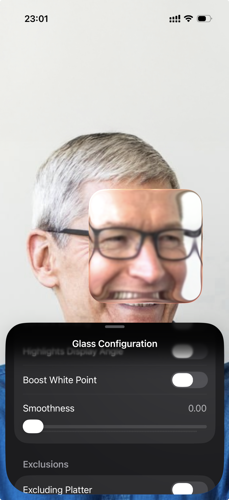

# GlassExplorer 🔍✨

A fun little iOS app that plays around with UIKit's private glass effect APIs. Basically lets you mess with glass blur effects on views and see what happens.

## What it does
- Shows a draggable glass effect overlay
- Lets you tweak glass properties in real-time 
- Uses some spicy private APIs (don't ship this to the App Store lol)
